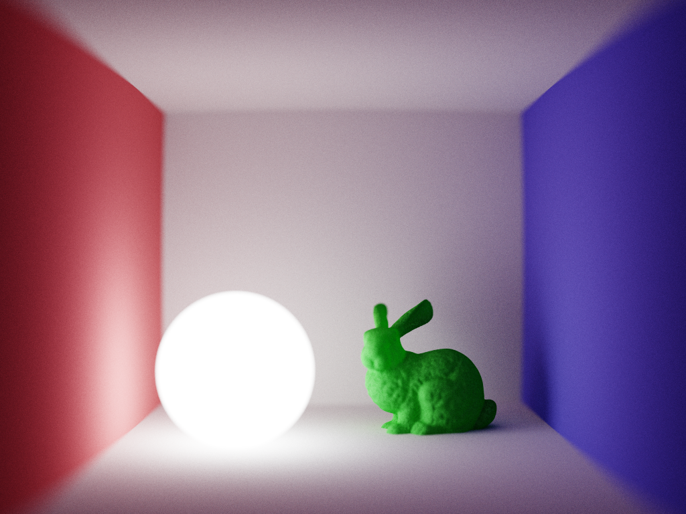

# Barnacle Renderer

## Overview

Barnacle is a toy renderer written in F# as part of UCSB 2025W CS263 course project. Here is a sample image rendered by Barnacle:

## Roadmap

Although this renderer is not designed for actual real-time rendering, we would still like to implement some real-time rendering techniques. Here are the features we plan to implement:
- [x] Path-traced DI & GI
- [ ] Support triangle mesh
- [x] Use BVH for acceleration
- [ ] Support simple PBR material
- [ ] Scene I/O & image/video output
- [ ] ReSTIR DI/neural denoiser/bidirectional path tracing/...